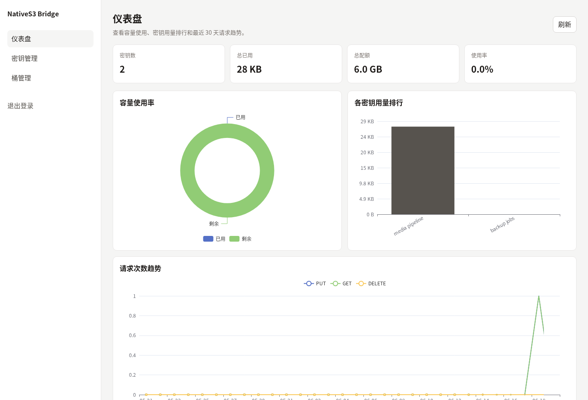
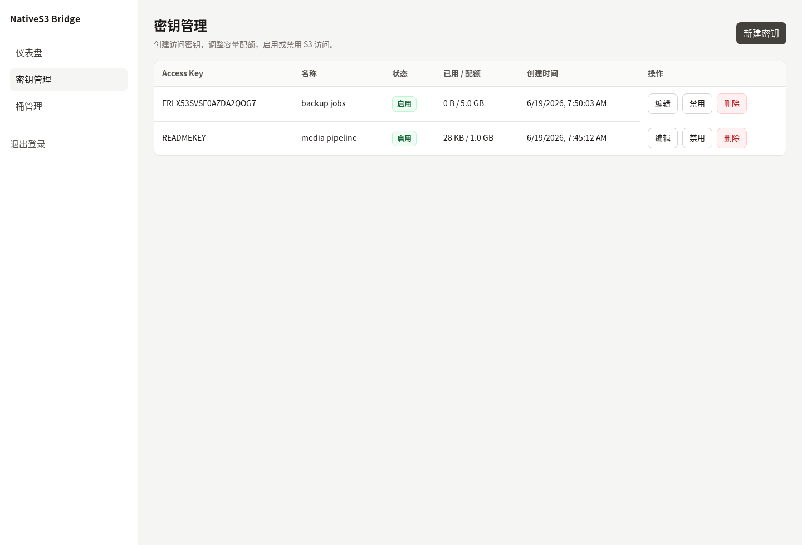
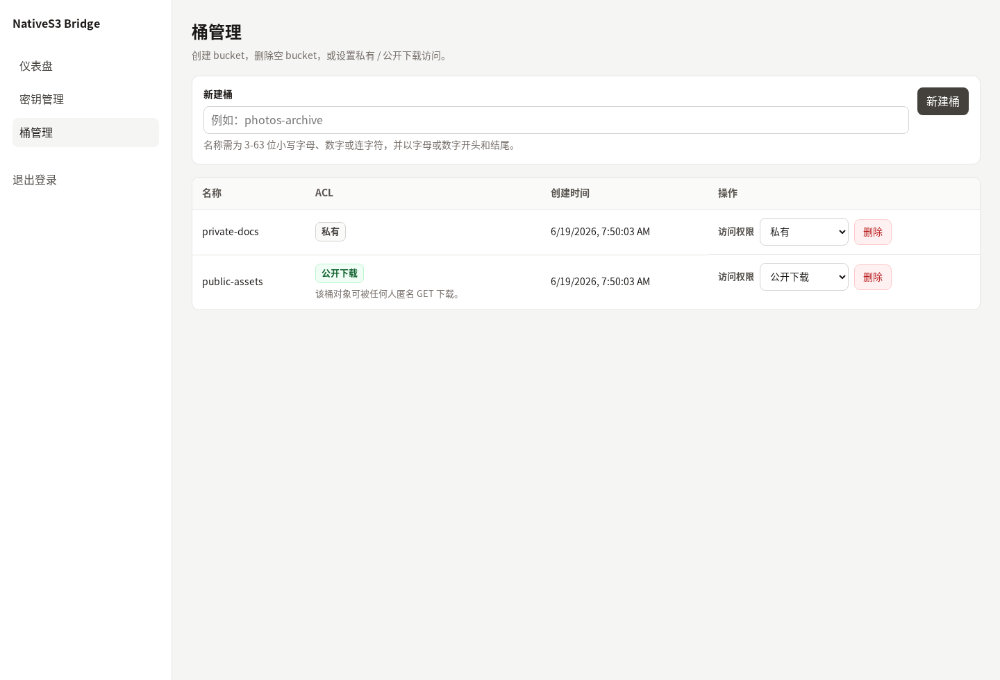

# NativeS3-Bridge

NativeS3-Bridge 是一个轻量的本地 S3 桥接中间件。它把操作系统上的真实目录映射为标准 S3 兼容 API，并内置一个 Vue3 管理后台，用于创建访问密钥、管理 bucket ACL、查看容量和请求趋势。

项目目标很明确：在不引入专有对象格式的前提下，让本地文件系统可以被 S3 客户端、业务服务、脚本和浏览器直链安全访问。

## 目录

- [核心能力](#核心能力)
- [界面预览](#界面预览)
- [适用场景](#适用场景)
- [架构与数据模型](#架构与数据模型)
- [快速开始](#快速开始)
- [配置说明](#配置说明)
- [S3 API 使用](#s3-api-使用)
- [管理后台](#管理后台)
- [公网安全部署](#公网安全部署)
- [运维端点与监控](#运维端点与监控)
- [事件钩子](#事件钩子)
- [Docker 部署](#docker-部署)
- [发布流程](#发布流程)
- [开发与验证](#开发与验证)
- [仓库文件与忽略规则](#仓库文件与忽略规则)

## 核心能力

| 能力 | 说明 |
|---|---|
| 原生文件 1:1 映射 | Bucket 是 `storage.data_root` 下的一级目录，Object Key 是 bucket 内的相对路径文件。对象字节以原始文件形式落盘，不切块、不封装、不改名。 |
| S3 兼容 API | 支持 Header SigV4、query presigned URL、对象 CRUD、bucket 操作、分段上传、批量删除、服务端复制、tagging、自定义元数据和 Range 下载。 |
| 多数据库 | 通过 GORM 支持 SQLite、MySQL、PostgreSQL，启动时自动迁移表结构。 |
| 配额与统计 | 每个 S3 credential 可设置 quota，PUT 和 multipart complete 会按最终对象大小计入用量，请求统计按 UTC 日期聚合。 |
| 匿名 public-read | Bucket ACL 支持 `private` 与 `public-read`。匿名访问仅允许 public-read bucket 的对象级 `GET`/`HEAD`。 |
| 管理后台 | 单密码登录，支持 TOTP、Turnstile-compatible captcha、credential CRUD、bucket ACL、ECharts 仪表盘和 Prometheus 指标。 |
| 单文件部署 | Vue3 管理界面构建产物通过 `go:embed` 打入 Go 二进制。运行时不需要 Node.js。 |
| 异步 Webhook | 对象创建、删除和 multipart complete 可异步投递事件，失败重试不阻塞 S3 请求。 |

## 界面预览

<details>
<summary>展开管理后台截图</summary>

管理后台提供容量、请求趋势、访问密钥和 bucket ACL 的集中视图。截图来自本地临时实例，示例数据通过真实 S3 上传和管理 API 写入。

### 仪表盘



### 密钥管理



### Bucket ACL



</details>

## 适用场景

<details>
<summary>展开适用 / 不适合场景</summary>

- 局域网或内网环境中，把已有目录快速暴露为 S3 接口。
- 游戏、互动引擎、AI 工作流、媒体处理脚本需要 S3 API，但希望对象仍是普通文件。
- 业务服务生成私有对象的短时预签名直链，终端用户通过浏览器或 HTTP 客户端直接下载。
- 小型团队需要一个单二进制、低运维成本的对象网关和管理后台。

不适合的场景：

- 需要 AWS IAM 级别策略、多租户隔离、对象级授权或多用户 RBAC。
- 需要分布式高可用、跨节点副本、纠删码、版本化或对象锁。
- 需要把文件存储为专有块格式或跨盘卷合并。

</details>

## 架构与数据模型

<details>
<summary>展开架构图、原生文件布局和数据库模型</summary>

```text
                 ┌──────────────────────────┐
                 │ cmd/natives3bridge/main  │
                 │ config -> DB -> wiring   │
                 └────────────┬─────────────┘
                              │
        ┌─────────────────────┴─────────────────────┐
        │                                           │
        v                                           v
┌───────────────────┐                       ┌───────────────────┐
│ S3 listener        │                       │ Admin listener     │
│ default :9000      │                       │ default :9001      │
│                   │                       │                   │
│ Recover            │                       │ /api/admin/*       │
│ Logging            │                       │ /healthz           │
│ Anonymous rate     │                       │ /readyz            │
│ SigV4 auth         │                       │ /metrics           │
│ Quota              │                       │ embedded SPA       │
└─────────┬─────────┘                       └─────────┬─────────┘
          │                                           │
          v                                           v
┌───────────────────┐                       ┌───────────────────┐
│ handlers          │                       │ webadmin           │
│ bucket/object     │                       │ auth/API/ops       │
│ multipart/tagging │                       │ Vue3 + ECharts     │
└─────────┬─────────┘                       └─────────┬─────────┘
          │                                           │
          └───────────────────┬───────────────────────┘
                              v
                    ┌───────────────────┐
                    │ storage + db      │
                    │ native files      │
                    │ sidecars          │
                    │ credentials       │
                    │ stats/hooks       │
                    └───────────────────┘
```

### 原生文件布局

假设配置为：

```yaml
storage:
  data_root: "./data"
  metadata_suffix: ".s3meta"
```

上传对象：

```text
bucket: media
key:    images/cover.jpg
```

落盘结果：

```text
data/
└── media/
    └── images/
        ├── cover.jpg
        └── cover.jpg.s3meta
```

`cover.jpg` 是原始对象字节，可直接用系统文件管理器、图片查看器或脚本读取。`.s3meta` 保存 ETag、Content-Type、自定义 metadata、tags、size 和上传时间。缺少 sidecar 时，服务仍能读取原生对象，只是 metadata/tags 为空或按扩展名推断。

### 数据库模型

| 表/模型 | 用途 |
|---|---|
| `credentials` | S3 access key、secret key、状态、quota、used bytes。 |
| `request_stats` | 按 credential 和 UTC 日期聚合 PUT/GET/DELETE 次数与字节数。 |
| `buckets` | bucket ACL 和创建时间。历史原生目录会按需补元数据，默认 private。 |
| `hook_configs` | Webhook URL、事件类型、启用状态。 |

对象字节、对象 metadata 和 tags 不存入数据库。

</details>

## 快速开始

<details>
<summary>展开构建、配置和启动步骤</summary>

### 1. 环境要求

- Go 1.21+
- Node.js 18+，仅在需要重新构建管理后台前端时使用
- AWS CLI，可选，用于端到端验证 S3 API
- Docker，可选，用于容器部署

### 2. 构建二进制

从完整源码构建时先构建前端，再构建 Go：

```bash
npm ci --prefix pkg/webadmin/ui
npm run build --prefix pkg/webadmin/ui
go build -o natives3bridge ./cmd/natives3bridge
```

如果 `pkg/webadmin/ui/dist/` 已经存在有效构建产物，可以直接执行 Go 构建：

```bash
go build -o natives3bridge ./cmd/natives3bridge
```

### 3. 准备配置

仓库不会提交真实运行配置。复制示例：

```bash
cp -n configs/config.example.yaml configs/config.yaml
```

Docker 部署建议从 Docker 示例开始：

```bash
cp -n configs/config.docker.example.yaml configs/config.yaml
```

先生成管理密码的 bcrypt hash：

```bash
htpasswd -bnBC 12 "" '你的高强度管理密码' | tr -d ':\n'
```

将 hash 写入配置，并生成随机 session secret。`password_hash` 为空时管理端登录保持禁用：

```yaml
webadmin:
  password_hash: "$2y$12$..."
  admin_bootstrap_password: ""
  session_secret: "replace-with-a-random-32-byte-secret"
```

### 4. 启动服务

```bash
./natives3bridge -config configs/config.yaml
```

本地测试也可以播种一个临时 S3 credential：

```bash
./natives3bridge -config configs/config.yaml \
  -seed-access-key TESTKEY \
  -seed-secret-key TESTSECRET \
  -seed-quota-bytes 0 \
  -seed-bucket ""
```

`-seed-bucket` 留空表示该密钥可访问所有桶；填入桶名则密钥只能操作该桶，且该桶必须已存在于 `buckets` 表中。

删除桶时，桶内存在对象或仍有密钥绑定都会被拒绝。请先清空对象，并在密钥管理中解绑或改绑相关密钥。

启动后默认端口：

| 服务 | 默认监听 | 用途 |
|---|---|---|
| S3 API | `0.0.0.0:9000` | AWS CLI、SDK、HTTP 客户端访问对象。 |
| 管理后台 | `0.0.0.0:9001` | 浏览器访问管理 UI 和 admin API。 |

首次启动若 `webadmin.password_hash` 为空且 `admin_bootstrap_password` 不为空，日志会输出生成的 bcrypt hash。把该 hash 写回配置，然后清空 `admin_bootstrap_password`：

```yaml
webadmin:
  password_hash: "$2a$10$..."
  admin_bootstrap_password: ""
```

### 5. 检查生产配置

```bash
./natives3bridge -check-config -config configs/config.yaml
```

该命令只加载和校验配置，不启动服务。它会输出 TLS、示例 session secret、bootstrap password、TOTP、captcha、ops endpoint 和 `trust_forwarded` 等生产安全 warning。

</details>

## 配置说明

<details>
<summary>展开完整配置字段说明</summary>

完整示例见 [configs/config.example.yaml](configs/config.example.yaml) 和 [configs/config.docker.example.yaml](configs/config.docker.example.yaml)。

### server

```yaml
server:
  s3_addr: "0.0.0.0:9000"
  admin_addr: "127.0.0.1:9001"
  tls:
    enabled: false
    cert_file: ""
    key_file: ""
  admin_tls:
    enabled: false
    cert_file: ""
    key_file: ""
```

- `s3_addr`：S3 listener 地址。
- `admin_addr`：管理后台 listener 地址，默认 `127.0.0.1:9001`。容器内通常使用 `0.0.0.0:9001`，再通过宿主机回环端口映射或可信 HTTPS 反向代理限制入口；明文公共监听会输出生产安全 warning。
- `tls`：S3 listener TLS 配置，也作为 `admin_tls` 省略时的兼容默认值。
- `admin_tls`：管理后台 TLS，可独立于 S3 listener 配置。

生产公网建议通过可信反向代理终止 HTTPS，并把应用 admin listener 绑定到内网地址；容器部署可在容器内监听通配地址，但宿主机端口应绑定回环地址。简单直连部署可以启用 `admin_tls`。

### storage

```yaml
storage:
  data_root: "./data"
  multipart_tmp: "./data/.multipart"
  metadata_suffix: ".s3meta"
  multipart_gc_interval: "1h"
  multipart_max_pending_bytes: 10737418240
  multipart_ttl: "24h"
```

- `data_root`：bucket 根目录。
- `multipart_tmp`：multipart 上传临时目录。生产建议放在 `data_root` 之外，例如 `/state/multipart`。
- `metadata_suffix`：sidecar 后缀。
- `multipart_gc_interval`：残留 multipart 目录清理周期。
- `multipart_max_pending_bytes`：所有待完成 multipart 分片的全局字节上限，默认 10 GiB。
- `multipart_ttl`：未完成 multipart 上传保留时间。

### database

```yaml
database:
  driver: "sqlite"
  dsn: "./natives3.db"
```

支持：

```yaml
# SQLite
database:
  driver: "sqlite"
  dsn: "./natives3.db"

# MySQL
database:
  driver: "mysql"
  dsn: "user:pass@tcp(127.0.0.1:3306)/natives3?charset=utf8mb4&parseTime=True&loc=Local"

# PostgreSQL
database:
  driver: "postgres"
  dsn: "host=127.0.0.1 user=postgres password=pass dbname=natives3 port=5432 sslmode=disable"
```

升级安全：

- 启动时会先打开数据库，再执行迁移。迁移失败或迁移后的 schema 校验失败时，服务会退出，不会启动 S3 或管理端口。
- SQLite 本地文件库在迁移前会运行 `PRAGMA integrity_check`。如果检查失败，迁移不会执行。
- SQLite DSN 指向已有且包含业务表的本地文件时，迁移前会用 SQLite `VACUUM INTO` 在同目录创建一致备份，文件名形如 `natives3.db.pre-upgrade-20260619T103000Z.bak`。新库、空库、`:memory:` 和 `file::memory:` 不会创建备份。
- SQLite 备份只保护关系数据库内容。对象字节仍在 `storage.data_root`，对象 metadata/tags 仍在 sidecar 文件中，升级前需要按你的部署方式一起备份数据目录。
- MySQL/PostgreSQL 不会在应用启动时复制表。表级复制可能慢、占锁、占空间且不一定是一致快照；生产升级前应使用数据库原生一致备份、托管快照、物理备份或 PITR。

### webadmin

```yaml
webadmin:
  password_hash: ""
  admin_bootstrap_password: ""
  session_secret: "replace-with-random-secret-at-least-32-bytes"
  session_ttl_minutes: 720
  login_max_failures: 5
  login_lockout_window: "15m"
  totp:
    enabled: false
    issuer: "NativeS3-Bridge"
    account: "admin"
    secret: ""
  captcha:
    enabled: false
    provider: "turnstile"
    site_key: ""
    secret_key: ""
    verify_url: "https://challenges.cloudflare.com/turnstile/v0/siteverify"
    timeout: "3s"
  ops:
    public_healthz: true
    public_readyz: false
    public_metrics: false
    metrics_token: ""
```

- `password_hash`：bcrypt 管理密码 hash。
- `admin_bootstrap_password`：仅首启生成 hash 使用，生成后必须清空。
- `session_secret`：session cookie HMAC secret，生产必须替换随机值。
- `login_max_failures` / `login_lockout_window`：同来源 IP 登录失败锁定。
- `totp.enabled`：启用后登录需要 6 位 TOTP code。`secret` 必须是有效 base32。
- `captcha.enabled`：启用 Turnstile-compatible server-side verification。
- `ops`：控制 `/healthz`、`/readyz`、`/metrics` 暴露边界。

### hooks

```yaml
hooks:
  queue_size: 1024
  workers: 4
  max_retry: 3
  timeout: "5s"
```

Webhook 投递在后台 goroutine 中进行。`max_retry` 表示首次投递失败后的重试次数，所以 `3` 代表最多 4 次投递尝试。

### rate_limit

```yaml
rate_limit:
  anonymous_rps: 10
  anonymous_burst: 20
  trust_forwarded: false
```

匿名限流只作用于 public-read 对象级 `GET`/`HEAD`。签名请求仍走 credential 和 quota 体系。

只有应用只能被可信反向代理访问，并且反代会覆盖 `X-Forwarded-For` / `X-Real-IP` 时，才应启用 `trust_forwarded`。

### 其他字段

```yaml
region: "us-east-1"
log_level: "info"
```

- `region`：SigV4 region，客户端签名必须匹配。
- `log_level`：`debug`、`info`、`warn`、`error`。

</details>

## S3 API 使用

<details>
<summary>展开 AWS CLI、支持范围和访问方式</summary>

### AWS CLI 环境变量

```bash
export AWS_ACCESS_KEY_ID=TESTKEY
export AWS_SECRET_ACCESS_KEY=TESTSECRET
export AWS_DEFAULT_REGION=us-east-1
EP="--endpoint-url http://127.0.0.1:9000"
```

### 常用操作

```bash
# 创建 bucket
aws $EP s3 mb s3://mybucket

# 上传对象
aws $EP s3api put-object \
  --bucket mybucket \
  --key docs/readme.txt \
  --body ./README.md \
  --metadata author=alice,project=demo

# 查看对象 metadata
aws $EP s3api head-object --bucket mybucket --key docs/readme.txt

# 列举对象
aws $EP s3api list-objects-v2 --bucket mybucket --prefix docs/

# 下载对象
aws $EP s3api get-object --bucket mybucket --key docs/readme.txt ./download.txt

# Range 下载
aws $EP s3api get-object \
  --bucket mybucket \
  --key docs/readme.txt \
  --range bytes=0-99 \
  ./partial.txt

# 删除对象
aws $EP s3api delete-object --bucket mybucket --key docs/readme.txt
```

### 支持范围

| 类别 | 操作 |
|---|---|
| Service | `GET /`，ListBuckets |
| Bucket | `PUT /{bucket}`、`DELETE /{bucket}`、`HEAD /{bucket}`、`GET /{bucket}` |
| Bucket probes | `GET /{bucket}?location`、`GET /{bucket}?versioning` |
| List objects | `ListObjectsV2`，支持 `prefix`、`delimiter`、`continuation-token`、`max-keys` |
| Object | `PUT`、`GET`、`HEAD`、`DELETE` |
| Object copy | `PUT` + `x-amz-copy-source` |
| Bulk delete | `POST /{bucket}?delete` |
| Multipart | Create、UploadPart、Complete、Abort、ListParts、ListMultipartUploads |
| Tagging | `PUT/GET/DELETE /{bucket}/{key}?tagging` |
| Metadata | `x-amz-meta-*` 自定义 metadata |
| Integrity | `Content-MD5` 校验，失败返回 `InvalidDigest` 或 `BadDigest` |
| Auth | Header SigV4 和 query presigned URL |
| Anonymous | public-read bucket 的对象级 `GET`/`HEAD` |

不支持或不属于当前目标：

- AWS IAM policy、bucket policy、ACL XML 兼容写接口。
- S3 versioning 的真实版本存储。
- Object Lock、SSE、Lifecycle、Replication。
- 匿名列 bucket、匿名写入、匿名删除。

### 预签名 URL

业务服务应优先使用 private bucket 加短 TTL 预签名 URL 暴露用户直链：

```bash
aws $EP s3 presign s3://mybucket/docs/readme.txt --expires-in 300
```

服务端会按 query SigV4 校验 `X-Amz-*` 参数。不要把完整预签名 URL 写入日志，因为 query string 中包含签名材料。

### public-read 直链

`public-read` bucket 只允许匿名对象级读取：

```bash
curl -I http://127.0.0.1:9000/public-bucket/path/file.txt
curl -o file.txt http://127.0.0.1:9000/public-bucket/path/file.txt
```

匿名访问矩阵：

| 请求 | private | public-read |
|---|---:|---:|
| `GET /bucket/key` | 403 | 200 或对象错误 |
| `HEAD /bucket/key` | 403 | 200 或对象错误 |
| `GET /bucket` list | 403 | 403 |
| `PUT/DELETE/POST` | 403 | 403 |
| `?tagging`、multipart 子资源 | 403 | 403 |

### 错误格式

S3 API 错误统一返回标准 XML：

```xml
<Error>
  <Code>AccessDenied</Code>
  <Message>access denied</Message>
  <Resource>/bucket/key</Resource>
  <RequestId>req-...</RequestId>
</Error>
```

每个 S3 响应都会带 `x-amz-request-id`，该 ID 也会出现在错误 XML 和访问日志中。

</details>

## 管理后台

<details>
<summary>展开登录流程和 Admin API</summary>

浏览器访问 `http://127.0.0.1:9001/`。管理后台是单用户模型，不提供多用户、RBAC 或 OIDC。

### 登录流程

登录 API：

```http
POST /api/admin/login
```

请求体：

```json
{
  "password": "admin-password",
  "totp_code": "123456",
  "captcha_token": "provider-token"
}
```

- `totp_code` 仅在 `webadmin.totp.enabled=true` 时需要。
- `captcha_token` 仅在 `webadmin.captcha.enabled=true` 时需要。
- 登录失败、TOTP 错误、captcha 失败都会计入同一来源 IP 的失败锁定。
- 登录成功后设置 `natives3_admin_session` HTTP-only cookie。

前端可读取非敏感登录设置：

```http
GET /api/admin/auth-settings
```

该接口只返回是否需要 TOTP、是否启用 captcha、captcha provider 和 site key，不返回 secret。

### Admin API

除 `/api/admin/login` 和 `/api/admin/auth-settings` 外，所有 `/api/admin/*` API 都需要 session cookie。

| 方法 | 路径 | 说明 |
|---|---|---|
| `POST` | `/api/admin/login` | 登录并设置 session cookie。 |
| `POST` | `/api/admin/logout` | 注销并清除 session cookie。 |
| `GET` | `/api/admin/auth-settings` | 返回登录页需要的非敏感认证设置。 |
| `GET` | `/api/admin/credentials` | 列出 credential，不返回 secret key。 |
| `POST` | `/api/admin/credentials` | 创建 credential，响应中仅本次返回 `secret_key`。 |
| `PATCH` | `/api/admin/credentials/{id}` | 更新名称、状态或 quota，并刷新 credential cache。 |
| `DELETE` | `/api/admin/credentials/{id}` | 删除 credential，并刷新 credential cache。 |
| `GET` | `/api/admin/buckets` | 列出 bucket 和 ACL。 |
| `POST` | `/api/admin/buckets` | 创建 bucket，默认 ACL 为 `private`。 |
| `DELETE` | `/api/admin/buckets/{name}` | 删除空 bucket。非空返回 409。 |
| `PUT` | `/api/admin/buckets/{name}/acl` | 设置 `private` 或 `public-read`。 |
| `GET` | `/api/admin/dashboard/summary` | credential 数量、总 quota、总 used bytes。 |
| `GET` | `/api/admin/dashboard/usage-ranking` | credential 用量排行。 |
| `GET` | `/api/admin/dashboard/request-trend?days=30` | 按 UTC 日期聚合请求趋势。 |

### Curl 示例

```bash
curl -c cookie.txt \
  -H "Content-Type: application/json" \
  -X POST http://127.0.0.1:9001/api/admin/login \
  -d '{"password":"your-password"}'

curl -b cookie.txt http://127.0.0.1:9001/api/admin/dashboard/summary

curl -b cookie.txt \
  -H "Content-Type: application/json" \
  -X POST http://127.0.0.1:9001/api/admin/credentials \
  -d '{"name":"service-a","quota_bytes":10737418240}'

curl -b cookie.txt \
  -H "Content-Type: application/json" \
  -X POST http://127.0.0.1:9001/api/admin/buckets \
  -d '{"name":"public-assets"}'

curl -b cookie.txt \
  -H "Content-Type: application/json" \
  -X PUT http://127.0.0.1:9001/api/admin/buckets/public-assets/acl \
  -d '{"acl":"public-read"}'
```

</details>

## 公网安全部署

<details>
<summary>展开反向代理示例和生产检查清单</summary>

公网部署要把 S3 API 和管理后台视为不同安全边界。

推荐拓扑：

```text
Internet
  |
  | HTTPS
  v
Reverse proxy / CDN / WAF
  |-- s3.example.com    -> NativeS3 S3 listener, usually :9000
  |-- admin.example.com -> NativeS3 admin listener, usually :9001
  |-- internal ops      -> /readyz and /metrics
```

### 基本原则

- 所有公网入口必须使用 HTTPS。
- S3 API 和管理后台使用不同域名，便于独立 cookie、限流、WAF 和日志策略。
- 管理后台公网访问不要只依赖单密码。建议启用 TOTP 和 captcha。
- `admin_addr` 尽量绑定内网地址，公网只通过反向代理访问。
- `trust_forwarded` 只在可信代理覆盖转发头时启用。
- 业务直链优先使用 private bucket + 短 TTL presigned URL。
- `public-read` 只用于明确对所有知道 URL 的人公开的对象。
- `/readyz` 和 `/metrics` 不应在公网裸露。

### Nginx 反向代理示例

```nginx
server {
    listen 443 ssl http2;
    server_name s3.example.com;

    ssl_certificate     /etc/letsencrypt/live/s3.example.com/fullchain.pem;
    ssl_certificate_key /etc/letsencrypt/live/s3.example.com/privkey.pem;

    client_max_body_size 0;

    location / {
        proxy_pass http://127.0.0.1:9000;
        proxy_http_version 1.1;
        proxy_set_header Host $host;
        proxy_set_header X-Real-IP $remote_addr;
        proxy_set_header X-Forwarded-For $proxy_add_x_forwarded_for;
        proxy_set_header X-Forwarded-Proto https;
    }
}

server {
    listen 443 ssl http2;
    server_name admin.example.com;

    ssl_certificate     /etc/letsencrypt/live/admin.example.com/fullchain.pem;
    ssl_certificate_key /etc/letsencrypt/live/admin.example.com/privkey.pem;

    location = /readyz {
        return 404;
    }

    location = /metrics {
        return 404;
    }

    location / {
        proxy_pass http://127.0.0.1:9001;
        proxy_http_version 1.1;
        proxy_set_header Host $host;
        proxy_set_header X-Real-IP $remote_addr;
        proxy_set_header X-Forwarded-For $proxy_add_x_forwarded_for;
        proxy_set_header X-Forwarded-Proto https;
    }
}
```

若开启 `rate_limit.trust_forwarded: true`，必须确保 NativeS3-Bridge 不能被绕过代理直接访问。

### 公网生产检查清单

- `natives3bridge -check-config -config configs/config.yaml` 已运行并审查 warning。
- HTTPS 已在应用或可信反向代理终止。
- `webadmin.password_hash` 已配置。
- `webadmin.admin_bootstrap_password` 已清空。
- `webadmin.session_secret` 已替换为随机值。
- `webadmin.totp.enabled: true`。
- `webadmin.captcha.enabled: true`，或有明确的内网/反代替代防护。
- `/readyz` 和 `/metrics` 未公开，或 `/metrics` 使用 bearer token。
- `rate_limit.trust_forwarded` 仅在可信反代后启用。
- 日志不记录 Authorization、Cookie、captcha token、session secret、完整 presigned URL 或对象内容。
- public-read bucket 中只有明确公开的对象。

</details>

## 运维端点与监控

<details>
<summary>展开健康检查和 Prometheus 指标</summary>

Ops endpoints 在 admin listener 上注册：

| 路径 | 默认行为 | 说明 |
|---|---|---|
| `/healthz` | 公开 | liveness，仅返回 `ok`，不访问数据库。 |
| `/readyz` | 默认隐藏 | readiness，检查数据库连接。 |
| `/metrics` | 默认隐藏 | Prometheus text format。 |

配置：

```yaml
webadmin:
  ops:
    public_healthz: true
    public_readyz: false
    public_metrics: false
    metrics_token: "random-token"
```

抓取 metrics：

```bash
curl -H "Authorization: Bearer random-token" \
  http://127.0.0.1:9001/metrics
```

当前指标：

```text
natives3_requests_total{op="put|get|delete"}
natives3_bytes_in_total
natives3_bytes_out_total
natives3_credentials
natives3_buckets
natives3_quota_bytes_total
natives3_used_bytes_total
natives3_database_up
```

指标不会包含 bucket name、object key、access key、secret 或 session。

</details>

## 事件钩子

<details>
<summary>展开 Webhook 事件格式和投递规则</summary>

Hook manager 从数据库的 `hook_configs` 表加载启用的 Webhook 配置。对象创建、对象删除和 multipart complete 会投递事件。

事件示例：

```json
{
  "type": "ObjectCreated",
  "bucket": "mybucket",
  "key": "docs/readme.txt",
  "size": 1234,
  "etag": "5d41402abc4b2a76b9719d911017c592",
  "metadata": {
    "author": "alice"
  },
  "credential_id": 1,
  "timestamp": "2026-06-19T12:00:00Z"
}
```

投递规则：

- 投递为异步后台任务，不阻塞 S3 响应。
- 队列满会丢弃事件并记录 warning。
- 非 2xx、连接失败或超时会按 `hooks.max_retry` 指数退避重试。
- 禁用的 hook config 不会投递。

当前 README 不提供 hook 配置管理 API。可通过数据库初始化或后续管理能力写入 `hook_configs`。

</details>

## Docker 部署

<details>
<summary>展开 docker run 和 compose 示例</summary>

### docker run

```bash
mkdir -p data state
sudo chown -R 10001:10001 data state

docker run -d --name natives3bridge \
  --restart unless-stopped \
  -p 9000:9000 \
  -p 9001:9001 \
  -v "$(pwd)/configs/config.yaml:/app/configs/config.yaml:ro" \
  -v "$(pwd)/data:/data" \
  -v "$(pwd)/state:/state" \
  ghcr.io/rsjwy/natives3-bridge:latest
```

### Docker Compose

仓库提供了 `docker-compose.example.yml`。默认按 SQLite 单容器模式运行：

```bash
cp docker-compose.example.yml docker-compose.yml
cp configs/config.docker.example.yaml configs/config.yaml
mkdir -p data state
sudo chown -R 10001:10001 data state
docker compose up -d
docker compose logs -f natives3bridge
```

如果要使用当前 checkout 构建镜像，而不是拉取 GHCR `latest`，编辑
`docker-compose.yml`，注释 `image: ghcr.io/rsjwy/natives3-bridge:latest`，取消
`build: .` 和 `image: natives3bridge:local` 的注释，然后运行：

```bash
docker compose up -d --build
```

容器内默认配置路径：

```bash
/app/configs/config.yaml
```

容器内建议路径：

```yaml
storage:
  data_root: "/data"
  multipart_tmp: "/state/multipart"
database:
  driver: "sqlite"
  dsn: "/state/natives3.db"
```

镜像默认以 UID/GID `10001:10001` 运行。挂载目录不可写时，调整宿主机目录属主或权限。

### Compose 数据库用法

SQLite 是默认推荐的单机部署方式，只需要 `natives3bridge` 一个容器：

```yaml
database:
  driver: "sqlite"
  dsn: "/state/natives3.db"
```

- 对象字节写入 `./data`。
- SQLite 数据库、multipart 临时目录和升级备份写入 `./state`。
- 启动迁移前会自动做 SQLite 完整性检查；已有业务表时会生成
  `./state/natives3.db.pre-upgrade-*.bak`。
- 升级前仍建议整体备份 `./data` 和 `./state`。

MySQL 适合已有 MySQL 运维体系的部署。先修改 `configs/config.yaml`：

```yaml
database:
  driver: "mysql"
  dsn: "natives3:change-me-mysql-password@tcp(mysql:3306)/natives3?charset=utf8mb4&parseTime=True&loc=Local"
```

然后启动 MySQL profile：

```bash
docker compose --profile mysql up -d
```

- DSN 里的 `mysql` 是 compose 文件中的服务名。
- `change-me-mysql-password` 必须和 `docker-compose.yml` 中
  `MYSQL_PASSWORD` 一致。
- 应用不会在启动时复制 MySQL 表；生产升级前用 MySQL 原生一致备份、
  托管快照或物理备份。

PostgreSQL 用法类似。先修改 `configs/config.yaml`：

```yaml
database:
  driver: "postgres"
  dsn: "host=postgres user=natives3 password=change-me-postgres-password dbname=natives3 port=5432 sslmode=disable"
```

然后启动 PostgreSQL profile：

```bash
docker compose --profile postgres up -d
```

- DSN 里的 `postgres` 是 compose 文件中的服务名。
- `change-me-postgres-password` 必须和 `docker-compose.yml` 中
  `POSTGRES_PASSWORD` 一致。
- 应用不会在启动时复制 PostgreSQL 表；生产升级前用 PostgreSQL 原生一致
  备份、托管快照、物理备份或 PITR。

无论使用哪种数据库，`storage.data_root` 都应保持为 `/data`，因为对象文件不存
在关系数据库中。

</details>

## 发布流程

<details>
<summary>展开 GitHub Release 和镜像发布说明</summary>

GitHub Actions 的 release workflow 支持 tag 触发和手动触发。

```bash
git tag v0.1.0
git push origin v0.1.0
```

发布流程会执行：

- `npm ci && npm run build` 构建 Web 管理后台。
- `go vet ./...` 和 `go test ./...`。
- 交叉编译 Linux、macOS、Windows 的 amd64/arm64 二进制。
- 上传 `.tar.gz` 包和 `checksums.txt` 到 GitHub Release。
- 构建并推送多架构 Docker 镜像到 GHCR。

镜像地址：

```text
ghcr.io/rsjwy/natives3-bridge:<tag>
ghcr.io/rsjwy/natives3-bridge:latest
```

手动运行 `Release` workflow 时可以输入发布 tag。若 tag 不存在，workflow 会基于当前构建提交创建该 tag；如需指定源码，可填写 `source_ref`。

</details>

## 开发与验证

<details>
<summary>展开本地命令、冒烟测试和代码结构</summary>

### 常用命令

```bash
npm ci --prefix pkg/webadmin/ui
npm run build --prefix pkg/webadmin/ui
go build ./...
go vet ./...
go test ./...
```

### 冒烟测试

先启动服务并准备有效 credential：

```bash
./natives3bridge -config configs/config.yaml \
  -seed-access-key TESTKEY \
  -seed-secret-key TESTSECRET \
  -seed-quota-bytes 0 \
  -seed-bucket ""
```

再运行：

```bash
AWS_ACCESS_KEY_ID=TESTKEY \
AWS_SECRET_ACCESS_KEY=TESTSECRET \
AWS_DEFAULT_REGION=us-east-1 \
EP="--endpoint-url http://localhost:9000" \
EP_HOST="http://localhost:9000" \
DATA_ROOT="./data" \
./scripts/smoke-test.sh
```

脚本覆盖：

- 创建 bucket。
- 上传、下载和字节比对。
- HEAD metadata。
- 列 bucket 和列对象。
- Range 下载。
- private bucket 匿名访问拒绝。
- 删除对象后的访问失败。

### 代码结构

```text
cmd/natives3bridge/      # 主程序入口和模块装配
pkg/config/              # YAML 配置、默认值、校验、生产 warning
pkg/db/                  # GORM 连接、模型、迁移
pkg/server/              # S3 listener、路由、中间件、匿名限流
pkg/auth/                # Header/query SigV4、credential cache、identity
pkg/quota/               # quota check 和 usage/stat 事务提交
pkg/handlers/            # bucket/object/multipart/tagging/presigned handlers
pkg/storage/             # 原生文件 backend、bucket metadata、sidecar、multipart
pkg/hooks/               # Webhook event manager
pkg/webadmin/            # 管理后台 API、auth、ops、embedded SPA
pkg/webadmin/ui/         # Vue3 + Vite + ECharts 前端
configs/                 # 示例配置
scripts/                 # 冒烟测试脚本
```

</details>

## 仓库文件与忽略规则

<details>
<summary>展开应提交和不应提交清单</summary>

提交前建议检查：

```bash
git status --short
git status --ignored --short
```

应提交：

- 业务代码：`cmd/`、`pkg/`、`configs/*.example.yaml`、`scripts/`。
- 文档：`README.md`、`AGENTS.md`、`.trellis/spec/`、已归档任务记录。
- 项目级 AI 工作流配置：`.agents/`、`.codex/`。
- 前端源码和锁文件：`pkg/webadmin/ui/src/`、`package.json`、`package-lock.json`。

不应提交：

- 真实配置：`configs/config.yaml`、`configs/config.local.yaml`。
- 本地数据：`data/`、`state/`。
- 本地数据库：`*.db`、`*.sqlite`、`*.sqlite3`。
- SQLite 升级备份：`*.pre-upgrade-*.bak*`。
- 构建产物：`natives3bridge`、`bin/`、`*.tar.gz`。
- 前端依赖和产物：`pkg/webadmin/ui/node_modules/`、`pkg/webadmin/ui/dist/assets/`、`pkg/webadmin/ui/dist/index.html`。
- Trellis 运行态：`.trellis/.developer`、`.trellis/.runtime/`、`__pycache__/`、`.trellis/.template-hashes.json` 的本地模板哈希改动。

`.trellis/.template-hashes.json` 当前在仓库中已跟踪，但它容易记录本地模板刷新、runtime session 和 Python cache 哈希。除非明确在升级 Trellis 模板并审查了 diff，否则不要把它和业务或文档提交混在一起。

</details>

## License

见仓库 LICENSE。若仓库尚未提供 LICENSE，请在正式分发前补充。

### 日志查看与轮转落盘

管理后台的「日志」页面可查看最近的运行日志和 S3 请求日志。默认仅保存在进程内存 ring 中（最多 2000 条，重启清空），stdout 始终保留。配置 `log.file` 后会同时写入轮转文件，并优先从当前日志文件读取管理页数据：

```yaml
log_level: "info"
log:
  file: "/state/logs/natives3bridge.log"
  max_size_mb: 100
  max_backups: 5
  max_age_days: 14
  compress: false
```

日志文件建议放在 Docker `state` 卷，禁止放入对象 `storage.data_root`。配置了不可写路径时服务会启动失败，避免静默丢日志。`max_backups: 0` 表示不保留历史文件；`max_age_days > 0` 时 lumberjack 会在轮转维护中清理超过该天数的历史文件。

### 存储对账

桶管理中的「存储对账」按单桶扫描原生对象文件，报告磁盘字节数、孤儿 `.s3meta` 和绑定密钥的 `used_bytes` 差异。首次操作始终为 dry-run；确认执行后，服务端会重新扫描、删除孤儿 sidecar，并把仅绑定该桶的每把密钥用量回写为本次扫描值。全桶密钥（`bucket` 为空）和其他桶密钥不会被修改，对账也不会删除或恢复对象文件。

大桶扫描为同步操作，建议在低峰期执行。磁盘是对象存在性的唯一真相源，对账不会创建 objects 数据库表。
